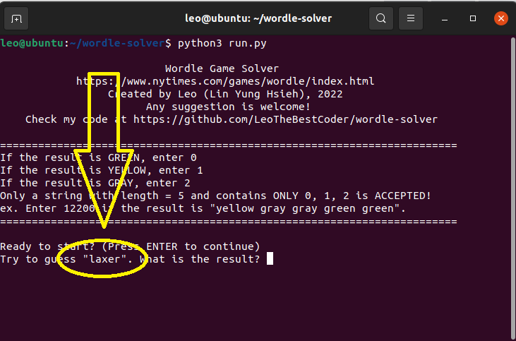
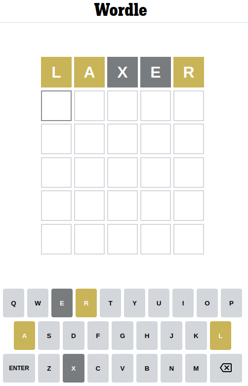
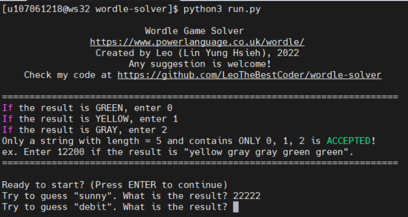
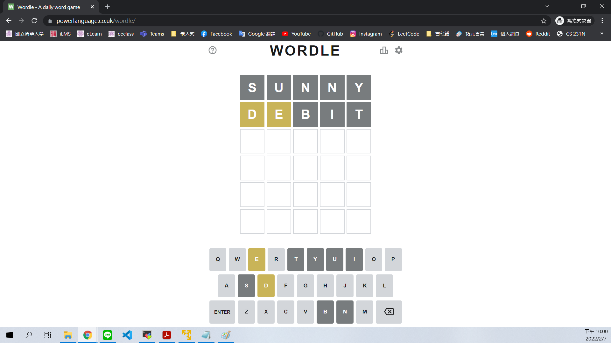
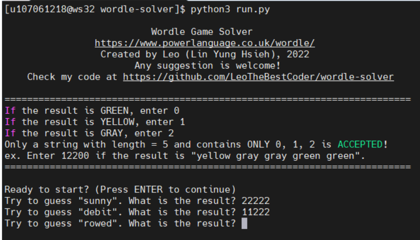
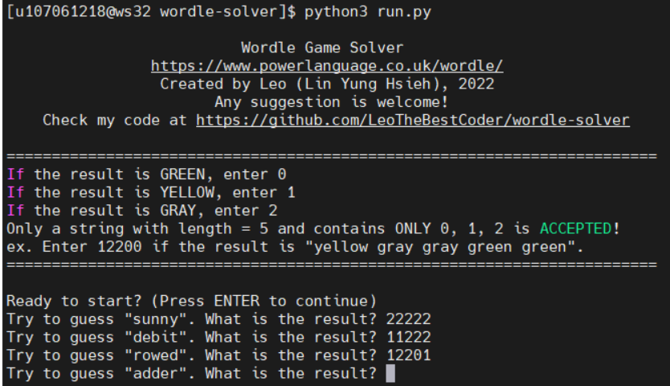
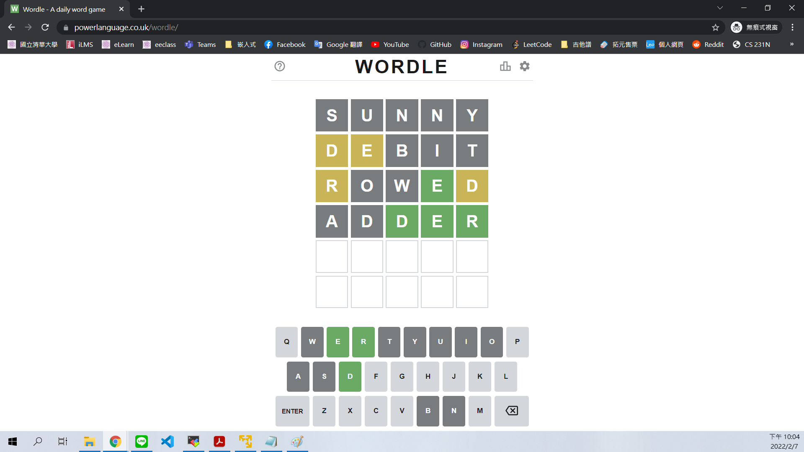
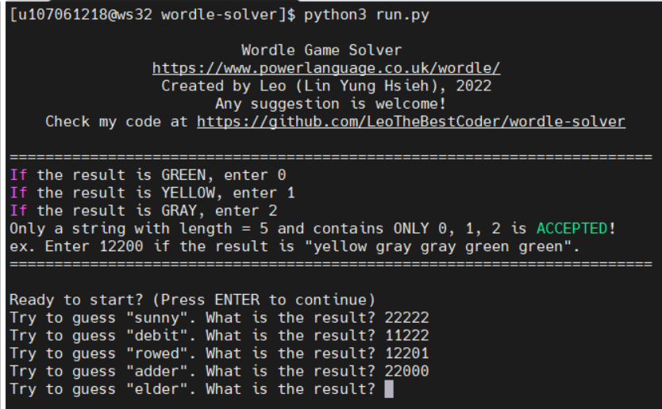
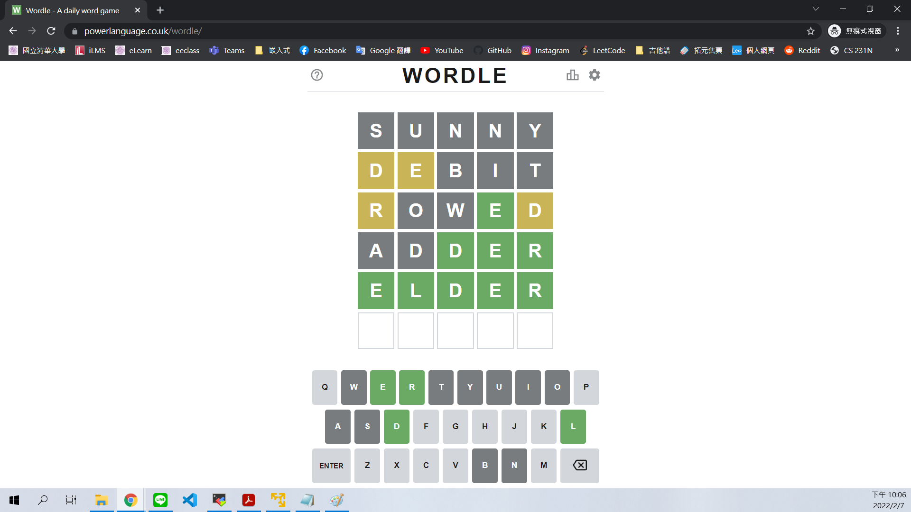

# Wordle Solver
## Author: Leo

## Environment Requirements
* Python3 (Python2 is NOT accepted.)

## Getting Started
1. clone the repo
```bash
git clone https://github.com/LeoTheBestCoder/wordle-solver
```

2. go into the directory
``` bash
cd wordle-solver
```

3. execute the python script **run.py** (Please ignore ```construct.py```)
```bash
python3 run.py
```
It should look like this.


Press ```ENTER``` to continue. 

> Later, if the result is `GREEN` (correct character + correct position), enter `0`. </br>
> If the result is `YELLOW` (correct character + wrong position), enter `1`. </br>
> If the result is `RED` (wrong character), enter `2`.


> **CAUTION!!!** </br>
> If the result isn't correctly entered, the program will be terminated right away. So, refer to the following example or demo video, and be extremely careful when entering the result. 


It tells you to guess "laxer" as the first attempt, so enter `laxer` into the wordle game.






The result is **`YELLOW YELLOW GRAY GRAY YELLOW`**, so enter **`11221`** in the terminal.





得到黃黃灰灰灰的結果，所以輸入11222，然後回去猜下一個字rowed




得到黃灰灰綠黃的結果，所以輸入12201，然後回去猜下一個字adder





得到灰灰綠綠綠的結果，所以輸入22000，然後回去猜下一個字elder





猜中XDD！

根據我的實測，目前猜中所需次數期望值約為4.38次，歡迎向我回報你們的結果噢！

喜歡我的程式歡迎按星星、追蹤我、開啟小鈴鐺，才不會錯過最新的程式噢😁😁😁