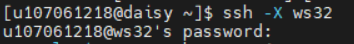
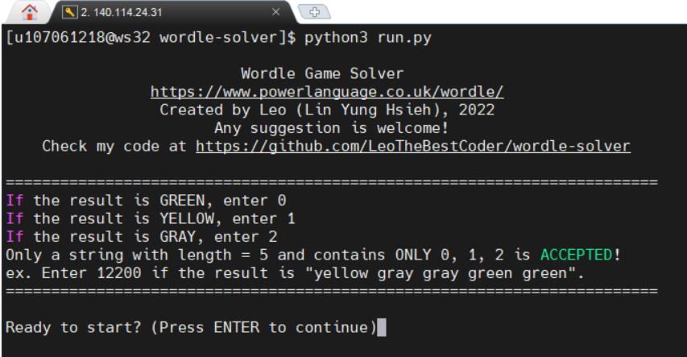
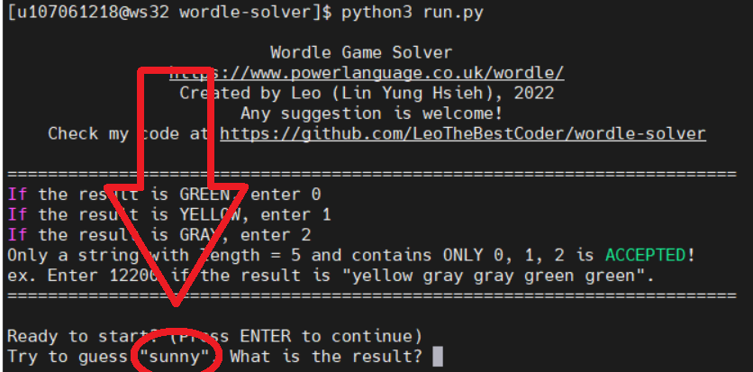
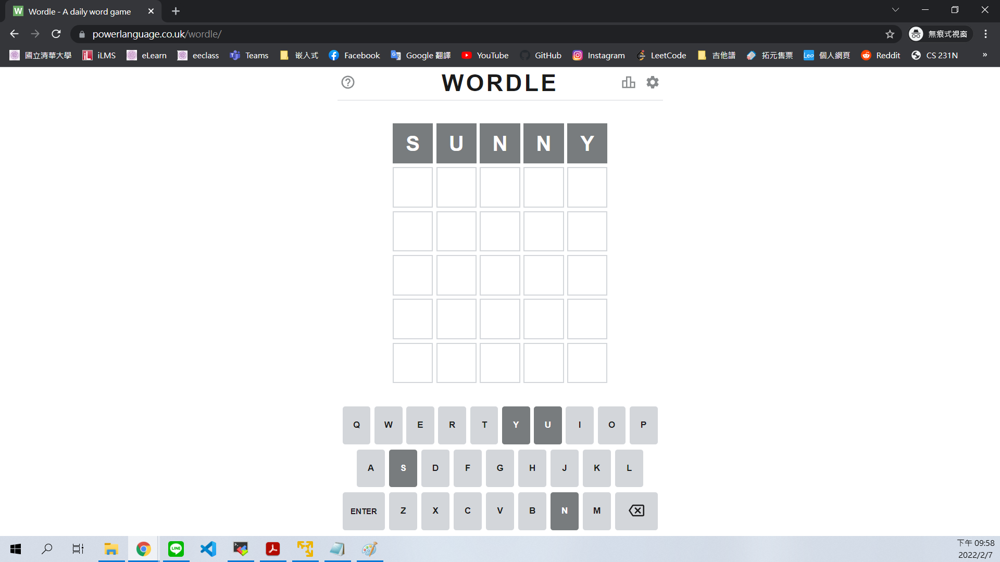

# Wordle Solver
## Author: Leo

嗨嗨大家，謝謝你來到這裡！以下會一步一步詳細教學這個solver要怎麼用，最後大家有沒有成功也歡迎回報給我知道噢XDD

開始之前需要先確認環境有安裝python3。如果不確定自己的windows有沒有，可以開之前修嵌入式用的虛擬機，如果沒修過，可以打開電機系的工作站，以下將以電機系工作站做示範。(如果不是用電機系工作站，請直接跳到第3步。)

1. 打開MobaXterm，登入140.114.24.31或140.114.24.33。

2. ssh連進workstation (以ws32為例)。**一定要連進來，不然daisy只有python2，程式會出錯QQ**
```bash
ssh -X ws32
```


3. clone the repo
```bash
git clone https://github.com/LeoTheBestCoder/wordle-solver
```

4. go into the directory
``` bash
cd wordle-solver
```

5. execute the python script **run.py** (請忽略construct.py)
```bash
python3 run.py
```
這時候應該會長這樣XD


不要怕，按下ENTER。上面那段文字在告訴你等一下如何回報結果。
> 如果是**綠色**(字母對、位置對)輸入**0**</br>
如果是**黃色**(字母對、位置錯)輸入**1**</br>
如果是**灰色**(字母錯)輸入**2**。</br>
等等依序輸入這五個位置的情況。</br>
結果回報的部分只要輸入錯誤，程式就會**報錯跳出**，**請參考以下範例小心輸入**。

這時他告訴你第一個字猜sunny，所以將sunny輸入wordle遊戲中。





得到灰灰灰灰灰的結果，所以輸入22222，然後回去猜下一個字debit


得到黃黃灰灰灰的結果，所以輸入11222，然後回去猜下一個字rowed


得到黃灰灰綠黃的結果，所以輸入12201，然後回去猜下一個字adder


得到灰灰綠綠綠的結果，所以輸入22000，然後回去猜下一個字elder


猜中XDD！

根據我的實測，目前猜中所需次數期望值約為4.38次，歡迎向我回報你們的結果噢！

喜歡我的程式歡迎按星星、追蹤我、開啟小鈴鐺，才不會錯過最新的程式噢😁😁😁